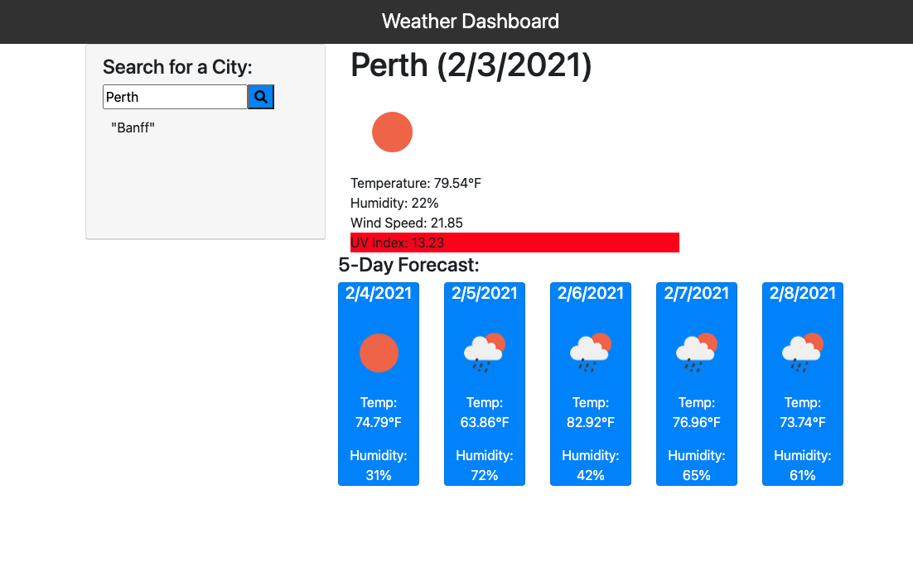

# Weather Dashboard: HW 6
## This is a readme file for my weather dashboard.

I built this project using HTML, CSS, Bootstrap, JS, and the Open Weather API. You'll need only a browser to make this work for you.

## How It Works
1. When the user enters the city into the search function, that input is concatenated into a url that is then fetched from the Open Weather API.
2. The returned data from both fetches is then added to the webpage, giving both the current weather and the weather forecast for the next five days.
3. When the site is refreshed, the most recent city can be seen underneath the search bar.

[Demo of My Page](https://drive.google.com/file/d/1oo1LtFrNcw1BFxnV4kPdY-dJAiCKrcnh/view)

[Link to Application](https://rachelamos.github.io/weather_dashboard/)

# Contributors:
- Rachel Amos
- Damian De Leon - Damian inspired me to look at making cards for my 'Search for a City' form.

## License & copyright

© Rachel Amos
Licensed under the [MIT License](LICENSE).